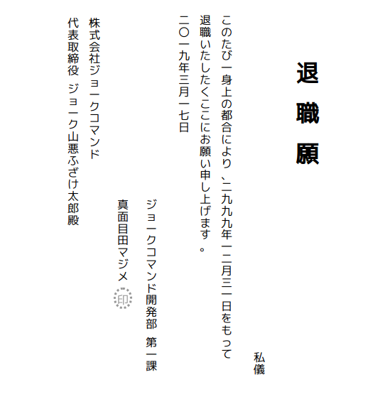

:toc:
:sectnums:

= taishoku

退職願をアスキーアートで出力するコマンド。
HTML出力もできる。

image:https://travis-ci.org/jiro4989/taishoku.svg?branch=master["Build Status", link="https://travis-ci.org/jiro4989/taishoku"]

== install

[source,bash]
go get -u github.com/jiro4989/taishoku

== development environment

 go version go1.11 linux/amd64

== usage

[source,bash]
taishoku

実行結果

 　　　代株　　　　二退こ　　　　　　
 　　　表式　　　　〇職の　　　　　　
 　　　取会　　　　一いた　　　　　　
 　　　締社　　　　九たび　　退　　　
 　　　役ジ　　　　年し一　　　　　　
 　　　　ョ　　　　三た身　　職　　　
 　　　ジー　　　　月く上　　　　　　
 　　　ョク　　　　一この　　願　　　
 　　　ーコ　　　　七こ都　　　　　　
 　　　クマ　　　　日に合　　　　　　
 　　　山ン　　　　　おに　　　　　　
 　　　悪ド　　　　　願よ　　　　　　
 　　　ふ　　　　　　いり　　　　　　
 　　　ざ　　　　　　申、　　　　　　
 　　　け　　真ジ　　し二　　　　　　
 　　　太　　面ョ　　上九　　　　　　
 　　　郎　　目ー　　げ九　　　　　　
 　　　殿　　田ク　　ま九　　　　　　
 　　　　　　マコ　　す年　　　　　　
 　　　　　　ジマ　　。一　　　　　　
 　　　　　　メン　　　二　　　　　　
 　　　　　　　ド　　　月　　　　　　
 　　　　　　印開　　　三　　　　　　
 　　　　　　　発　　　一　　　　　　
 　　　　　　　部　　　日　　　　　　
 　　　　　　　　　　　を　私　　　　
 　　　　　　　第　　　も　儀　　　　
 　　　　　　　一　　　っ　　　　　　
 　　　　　　　課　　　て　　　　　　

== usacase

.共同作業者に退職の意図を伝える
[source,bash]
taishoku | wall

.唐突に職場を離れることになったときに、次回作業者に退職の意図を伝える
[source,bash]
echo taishoku >> ~/.bashrc

.そのまま使う
[source,bash]
taishoku --your-name 退職太郎 -y 2019 -m 1 -d 1

.HTML出力
[source,bash]
taishoku --format html > taishoku_negai.html



== help

[source,bash]
taishoku -h

```
taishoku prints Japanese one's resignation ASCII Art.

Repository: https://github.com/jiro4989/taishoku
    Author: jiro4989
   Version: 1.3.1

Example:

　　　代株　　　　二退こ　　　　　　
　　　表式　　　　〇職の　　　　　　
　　　取会　　　　一いた　　　　　　
　　　締社　　　　九たび　　退　　　
　　　役ジ　　　　年し一　　　　　　
　　　　ョ　　　　三た身　　職　　　
　　　ジー　　　　月く上　　　　　　
　　　ョク　　　　一この　　願　　　
　　　ーコ　　　　七こ都　　　　　　
　　　クマ　　　　日に合　　　　　　
　　　山ン　　　　　おに　　　　　　
　　　悪ド　　　　　願よ　　　　　　
　　　ふ　　　　　　いり　　　　　　
　　　ざ　　　　　　申、　　　　　　
　　　け　　真ジ　　し二　　　　　　
　　　太　　面ョ　　上九　　　　　　
　　　郎　　目ー　　げ九　　　　　　
　　　殿　　田ク　　ま九　　　　　　
　　　　　　マコ　　す年　　　　　　
　　　　　　ジマ　　。一　　　　　　
　　　　　　メン　　　二　　　　　　
　　　　　　　ド　　　月　　　　　　
　　　　　　印開　　　三　　　　　　
　　　　　　　発　　　一　　　　　　
　　　　　　　部　　　日　　　　　　
　　　　　　　　　　　を　私　　　　
　　　　　　　第　　　も　儀　　　　
　　　　　　　一　　　っ　　　　　　
　　　　　　　課　　　て

Usage:
  taishoku [flags]

Flags:
      --todoke                  taishoku todoke
  -o, --offset int              offset (default 3)
      --format string           format [html]
  -y, --year int                year (default 2999)
  -m, --month int               month (default 12)
  -d, --day int                 day (default 31)
  -D, --department string       your department (default "ジョークコマンド開発部")
  -T, --team string             your team (default "第一課")
  -n, --your-name string        your name (default "真面目田マジメ")
  -C, --company string          company name (default "株式会社ジョークコマンド")
  -P, --president string        president (default "代表取締役")
  -N, --president-name string   president name (default "ジョーク山悪ふざけ太郎")
  -X, --debug                   debug logging flag.
  -h, --help                    help for taishoku
```
